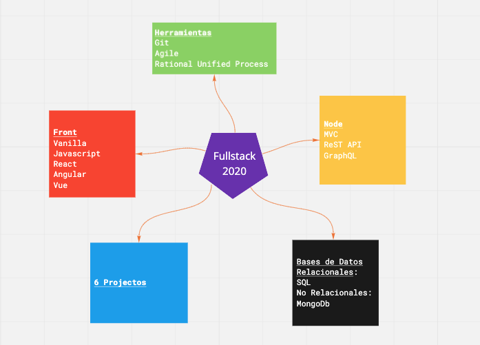
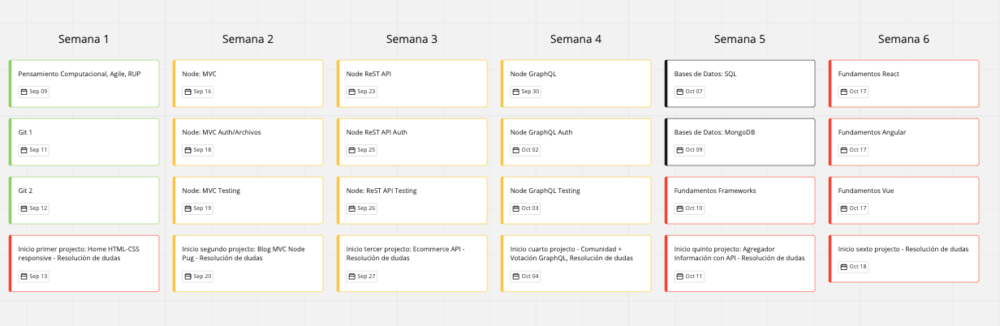
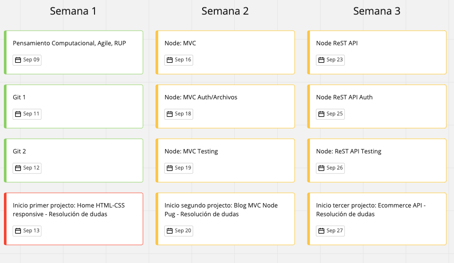
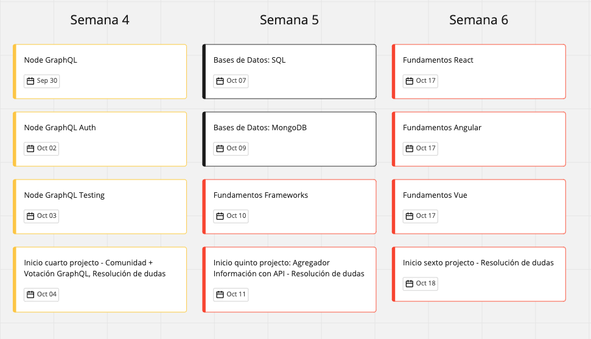

# Sprint with Carlos

**Autor: Carlos Marchena @ 2019**

## Descripción 

## Contenido Programático

Es un programa formativo dirigido a personas con conocimientos intermedios o avanzados en HTML, CSS y Javascript que ya tengan alguna experiencia en crear sitios web estáticos y que quieran dar el salto a diseñar, implementar y mantener sitios web dinámicos que interactúen con bases de datos y tengas rutas proetegidas mediante autenticación y autorización. 

El programa tiene una duración de 24 horas académicas más 24 horas de prácticas y resolución de dudas que son impartidas a lo largo de 6 semanas.

Al final del programa, el alumno contará con un portfolio de 6 proyectos que funcionará como carta de presentación en postulaciones a ofertas laborales de nivel junior.

### Primera semana
- Pensamiento Computacional
- Metodologías Ágiles
- Proceso Unificado Racional como método de desarrollo de software
- Git

### Segunda semana

- Introducción a los servidores: HTTP
- Node
- Auth/Archivos
- Testing: Ciclo Rojo/Verde/Refactorizar(TDD)
### Tercera semana

- RESTful APIs
- Auth/Archivos
- Testing: Postman

### Cuarta semana

- GraphQl
- Auth/Archivos
- Testing
### Quinta semana
- Bases de Datos
- SQL
- MongoDB
- Refactización para dar persistencia a la data
### Sexta semana
- Frameworks de Front
- React
- Angular
- Vue
### Proyectos
1. HTML/CSS/JavaScript: Landing page de producto
2. MVC: Blog en Node
3. RestFUL API: Ecommerce API
4. GraphQl: Comunidad y votación
5. Agregador de Información patrón cliente servidor
6. Proyecto final adaptado a las necesidades del alumno