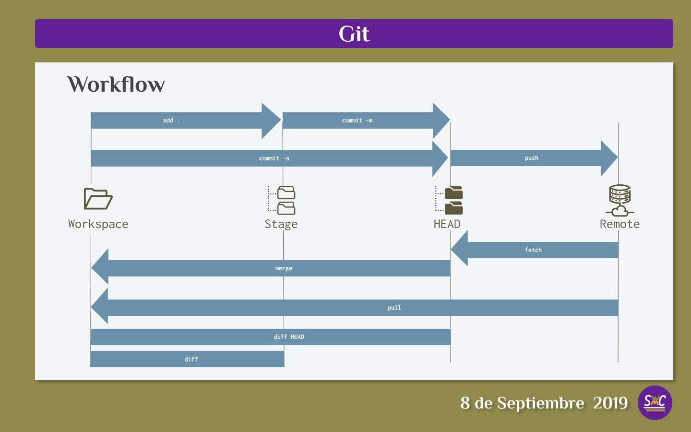
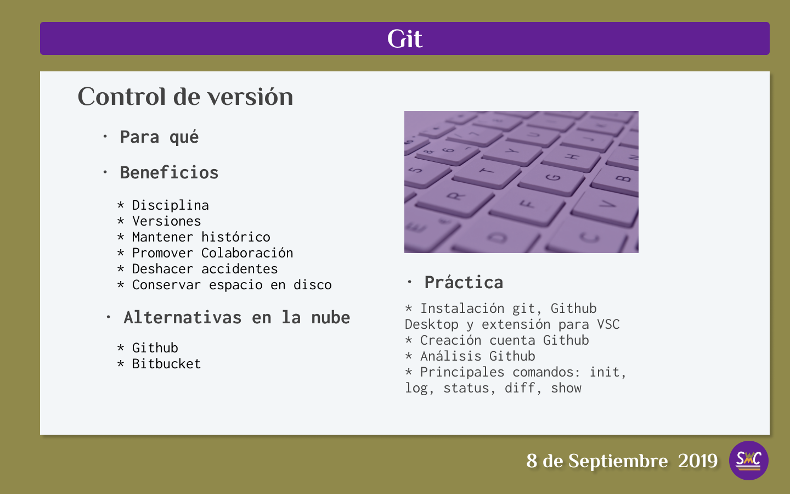

# Sprint with Carlos
## Primera Semana

### Primera clase
- Pensamiento Computacional
- Proceso Unificado Racional como método de desarrollo de software
- Métodos *Agile*
#### Pensamiento Computacional
En la actualidad muchas personas asocian la computación al computador personal y los *smartphones*, cuando en realidad su historia inició muchos antes. El ábaco, inventado en Babilonia entre 2700 y 2400 años antes de Cristo es el primer dispositivo de computación del que se tenga conocimiento.
 
La computación va mucho más allá de las limitaciones de un dispositivo específico, ya que se refiere al estudio de la resolución sistemática de problemas: 
>La computación es el estudio de los problemas, la resolución de problemas y las soluciones que surgen del proceso de resolución de problemas.Dado un problema, el objetivo de un científico de la computación es desarrollar un *algoritmo*, una lista paso a paso de instrucciones para resolver cualquier instancia del problema que pueda surgir. Los algoritmos son procesos finitos que, si se siguen, resolverán el problema. Los algoritmos son soluciones. 
*Miller, Brad y Ranum, David, Resolución de problemas con algoritmos y estructuras de datos con Python*

Por otra parte, esos algoritmos pueden implementarse mediante el uso de dispositivos de computación, y es estos casos cuando algoritmos se convierten en *sotfware*:
>El software es una descripción abstracta de un conjunto de instrucciones de cómputo que se materializa y, por lo tanto, es útil, sólo cuando ejecutamos el software en algún hardware, y ademas, en el contexto de alguna actividad humana a la que da apoyo. 
*Profesor Alex Orso de Georgia Tech CS6300*

Producto de la experiencia en esta disciplina, hoy contamos con un inmenso patrimonio teórico y práctico que está a disposición de cualquiera que quiera dedicar tiempo y esfuerzo para aprender.

#### Proceso Unificado Racional

**Fases tradicionales del desarrollo de software**
≈ **Toma de requerimientos**
*Sofware Requirement Specifications*
≈ **Diseño**
Architectura y Patrones
≈ **Implementación**
Picar código, implementación
≈ **Validación y Verificación**
- Contruir el software correcto y construir el software correctamente

≈ **Mantenimiento**
Puede ser de tres tipos:
- Perfectivo
- Correctivo
- Adaptativo

#### Métodos *Agile*
Dependiento del tipo de proyecto que se vaya a desarrollar se escojerá el proceso más adecuado. El rango de opciones va desde el proceso más tradicional, llamado **cascada**, en el cual cada fase se inicia sólo cuando la anterior esté cumplida, hasta los métodos más nuevos, conocidos como *agile*. El equilibrio entre disciplina y agilidad es uno de los principales factores de éxito de un proyecto de desarrollo de software
##### SCRUM
Scrum es un marco para desarrollar y mantener productos complejos.  Ken Schwaber y Jeff Sutherland son los autores de Scrum y define los roles, eventos, artefactos y las reglas que los unen. 
[Guía Scrum en español](https://www.scrumguides.org/docs/scrumguide/v2017/2017-Scrum-Guide-Spanish-European.pdf#zoom=100)

Los elementos más importantes son:

**≈ Definición de "Hecho"**
En cada proyecto es necesario que todos los participantes sepan que cuando alguien diga que un item está terminado, todos compartan la misma definición. Es por ello que debe ser acordada previamente por todos los integrantes y documentada por escrito, ya que será una fuente continua de consultas al momento de redactar los items y sus correspondientes *criterios de Aceptación**(en lo sucesivo *Criteria of Acceptance* o *COAs* por sus siglas en inglés)
**≈ Historias de usuarios**
También llamadas items del backlog de producto (*Product Backlog Item* o *PBIs* por sus siglas en inglés), son:  
- un vehículo que invita a la conversación con el usuario para poder plasmar de manera fidedigna las necesidades que tiene.
- una plantilla para definir de manera sucinta el *qué*, el *cómo* y el *para qué* de ese item
- una manera de confirmar que la calidad definida en el proyecto se cumple, mediante los *criterios de aceptación*

> **Como** *rol del usuario*
> **Quiero** *funcionalidad*
> **Para** *objetivo*

**Ejemplo:**

> **Como** *administrador*
> **Quiero** *editar los permisos  de los usuarios*
> **Para** *poder controlar los privilegios de cada quién dentro de la aplicación*

Todas las historias de usuario deben incluir los *COAs* si la historia efectivamente se ha completado cumpliendo con las especificaciones. Sólo cuando todos estén cumplidos se considerará que la historia está completa. La definición de los criterios de aceptación hecha sólo con palabras puede resultar ambigua por ello lo ideal es que esto se verifique a través de testing automático, por ello la importancia de la programación basada en pruebas (en lo sucesivo *TDD* o *Testing Driven Development*)

Tareas
**Mas información** 
- [Scrumguides.org](https://www.scrumguides.org/docs/scrumguide/v1/scrum-guide-us.pdf)
- [Definition of Done vs. User Stories vs. Acceptance Criteria](https://agilepainrelief.com/notesfromatooluser/2017/05/definition-of-done-vs-user-stories-vs-acceptance-criteria.html#.XCeRWtEo8Wp)

### Segunda clase
- Git 1
### Tercera clase
- Git 2

### Primer Proyecto
1. HTML/CSS/JavaScript: Landing page de producto

### Recursos 
[Miller, Brad y Ranum, David, Resolución de problemas con algoritmos y estructuras de datos con Python - versión online en inglés](https://runestone.academy/runestone/books/published/pythonds/index.html)

@ Carlos Marchena - 2019. Todos los derechos reservados