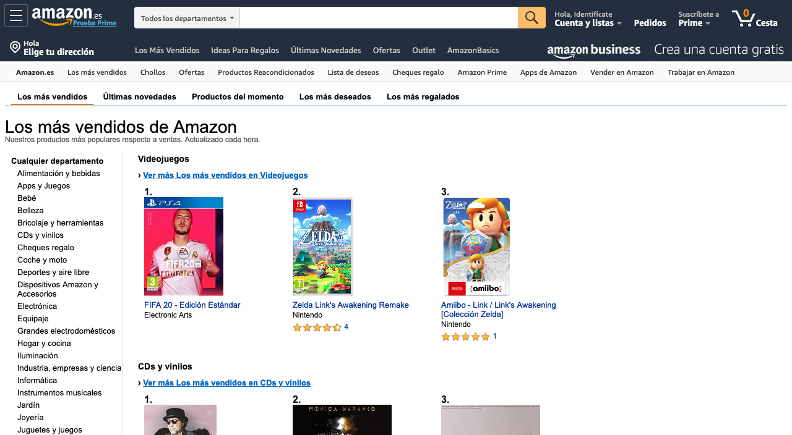
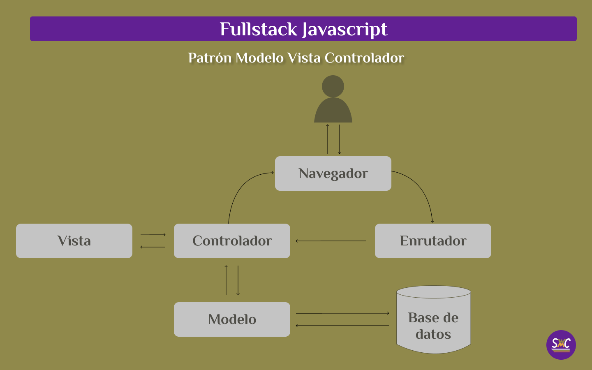

# Semana 01 - Clase 01: Patrón Modelo Vista Controlador
## Introducción
Un sitio web estático es simplemente una coleeción de archivos HTML alque son enviados al usuario en función de la [URL](https://es.wikipedia.org/wiki/Localizador_de_recursos_uniforme) que éste solicite. Pongamos de ejmplo el sitio web http://www.ejemplo.com que tenga sólo 4 páginas:
```
|_Home
    |___Nuestros Servicios
    |___Quiénes Somos
    |___Contáctanos
```
y sus respectivas URLs:
```
|_http://ejemplo.com/
    |___http://ejemplo.com/servicios
    |___http://ejemplo.com/equipo
    |___http://ejemplo.com/contacto
```
De esta manera, cada vez que el usuario del sitio quiera ver la página "Contáctanos", en su navegador utilizaría la URL http://ejemplo.com/contacto

Para un proyecto de esas dimensiones, esta architectura es suficiente, haciéndose obvio que este enfoque no será sostenible si el sitio aumenta en número de páginas. ¿Qué pasaría si Ejemplo decide que cada servicio tenga una página individual en lugar de estar todos juntos como ahora y los servicios aumenten a 20? Imagina que quisiéramos cambiar un detalle del encabezado o del pie de página, que son elementos comunes? Que ese cambio, por mínimo que fuera, tendría que hacerse en cada página. No es escalable ni sostenible.

>Mucho menos para un sitio como Amazon, como miles de referencias.

Para este tipo de casos se creó el patrón Modelo-Vista-Controlador (en lo sucesivo MVC), que permite superar las limitaciones de HTML que no nos permite introducir lógica ni datos de forma dinámica. Así que en lugar de escribir cada dato a mano (*hardcoded*), podremos construir n páginas en HTML con su correspondiene estilo CSS e interacciones con Javascript de forma **dinámica** a partir de una **plantilla** que tiene los elementos comunes ya predefinidos y *renderiza* (convierte en elementos de HTML el código JavaScript) injectando los datos necesarios en función de la petición del usuario.

En la práctica, si tuviéramos esta ficha de producto en HTML, pudiéramos observar que hay elementos comunes como la foto, la descripción de la foto, el título, el precio y la descripción.

```
<section>
        <article class="product">
            <figure>
                
            </figure>
            <figcaption>Taza de Café</figcaption>
            <h2>Taza de Café</h2>
            <p>Precio: 20€</>
                <p>Sorprende a tus clientes con esta hermosa taza de café en cristal</p>
        </article>
    </section>
```
MVC nos permite entonces tener una plantilla de elementos comunes a los cuales se les puede injectar data. En este ejemplo vemos el uso de EJS como lenguaje de plantillas, el cual utiliza los símbolos <%= %> como contenedores de datos y lógica
```
<section>
        <article class="product">
            <figure>
                 alt="taza de café">
            </figure>
            <figcaption><%=producto.descripción-foto%></figcaption>
            <h2><%= producto.titulo %></h2>
            <p>Precio: <%=producto.precio %></>
                <p><%= producto.descripcion-producto%></p>
        </article>
    </section>
```

**Vista**
- Es lo que ve el usuario (UI)
- Usualmente consiste en HTML y CSS
- Se comunica con el controlador
- Puede recibir datos dinámicos desde el controlador
- Utiliza motores de plantillas
**Modelo**
- Datos y lógica
- Conexión con la base de datos
- Se comunica con el controlador
**Controlador**
- Procesa las peticiones HTTP desde el enrutador
- Obtiene datos del modelo
- Envía los datos a la vista
- Envía la vista y los datos de vuelta al cliente

## Motores de plantillas
- [EJS](https://ejs.co/)
- [Pug/Jade](https://pugjs.org/api/getting-started.html)
- [Handlebars](https://handlebarsjs.com/)
## Rutas protegidas
- Autenticación y Autorización 

@ Carlos Marchena - 2019. Todos los derechos reservados