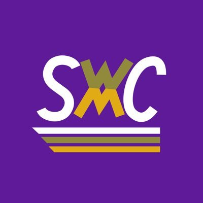

# Sprint with Carlos

## Cuarta Semana

Para el modulo 6 "Frameworks de JavaScript", partiremos en los tres casos de un mismo prototipo.
[Versión Mobile](https://www.figma.com/file/5GKrkEqTIAOIgYZZjpwUjT/blog?node-id=0%3A1)
<iframe style="border: none;" width="800" height="450" src="https://www.figma.com/embed?embed_host=share&url=https%3A%2F%2Fwww.figma.com%2Fproto%2F5GKrkEqTIAOIgYZZjpwUjT%2Fblog%3Fnode-id%3D1%253A340%26viewport%3D192%252C377%252C0.605482816696167%26scaling%3Dscale-down" allowfullscreen></iframe>

[Version iPad](https://www.figma.com/proto/5GKrkEqTIAOIgYZZjpwUjT/blog?node-id=57%3A28&viewport=-603%2C238%2C0.31085705757141113&scaling=contain)
<iframe style="border: none;" width="800" height="450" src="https://www.figma.com/embed?embed_host=share&url=https%3A%2F%2Fwww.figma.com%2Fproto%2F5GKrkEqTIAOIgYZZjpwUjT%2Fblog%3Fnode-id%3D57%253A28%26viewport%3D-603%252C238%252C0.31085705757141113%26scaling%3Dcontain" allowfullscreen></iframe>

[Prototipo](https://www.figma.com/proto/5GKrkEqTIAOIgYZZjpwUjT/blog?node-id=1%3A340&viewport=192%2C377%2C0.605482816696167&scaling=scale-down)
[Prototipo Vue](https://swc-demo-vue.now.sh/)
**Nota** Si no puedes visualizar este archivo en Github, utiliza la versión HTML en este mismo directorio.